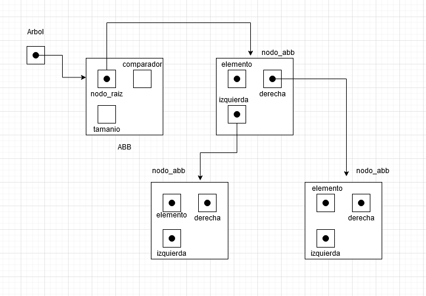
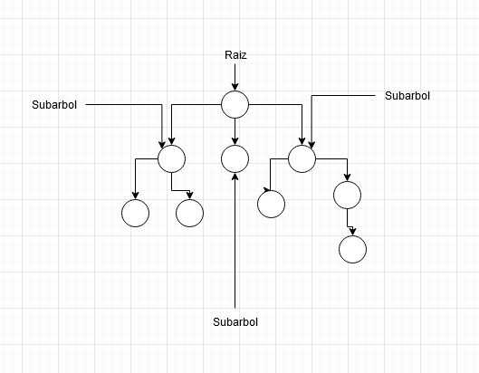

# TDA ABB

- Para compilar:

```bash
gcc -std=c99 -Wall -Wconversion -Wtype-limits -pedantic -Werror -O2 -g src/*.c pruebas_alumno.c -o pruebas_alumno
```

- Para ejecutar:

```bash
Para ejecutar con el ejemplo ./ejemplo

Para ejecutar con las pruebas implementadas ./pruebas_alumno
```

- Para ejecutar con valgrind:
```bash
valgrind --leak-check=full --track-origins=yes --show-reachable=yes --error-exitcode=2 --show-leak-kinds=all --trace-children=yes ./pruebas_alumno
```
---
##  Funcionamiento

En este TP se implemento un TDA ABB, es decir un Árbol Binario de Búsqueda con sus funciones previamente establecidas y una condición de ordenamiento en la que a través de un comparador, los elementos serán ordenados de manera tal que los elementos menores a la raíz quedaran del lado izquierdo del Árbol mientras que los elementos mayores a la raíz quedaran del lado derecho del mismo.

El ABB, esta compuesto por dos estructuras principales, El ABB y el Nodo_ABB. La estructura ABB, esta compuesta por un puntero a su nodo raíz, la cantidad de elementos en el mismo y un comparador de elementos. El Nodo_ABB, contiene un puntero al elemento que contiene, un puntero a su hijo izquierdo y un puntero a su hijo derecho. Según la convención tomada, el hijo izquierdo tendrá un elemento menor al nodo y el hijo derecho un elemento mayor.

Con esto, podemos crear un Árbol ordenado constantemente que aunque sea manipulado, este seguirá ordenado.

Diagrama de las estructuras utilizadas:

<div align="center">

</div>


En este TP gracias a la naturaleza del ABB casi todas las funciones fueron hechas de manera recursiva ya que esto nos permite implementar el ABB de una manera mas sencilla y es mas eficaz a la hora de moverse por el árbol y manipular sus datos y ademas la recursividad nos ayuda a dejar el código mucho mas claro y entendible que de manera iterativa.

Para crear el ABB, se llama a la función abb_crear(), que a través del uso de calloc() nos reserva memoria para el árbol y lo inicializa, también se le establece el comparador que se va a utilizar al árbol.

Para insertar un nuevo elemento al árbol, se llama a la función abb_insertar() la cual con ayuda de la función insertar_elemento(), recorre el árbol comparando los elementos con el comparador y si el elemento dado es menor a la raíz, se reserva memoria para el nuevo nodo e inserta ahí el elemento deseado y aumenta el tamanio del árbol, si el elemento es mayor hace lo mismo pero con el nodo derecho de la raíz. Si la raíz es nula, el elemento se introduce ahí mismo(también reservandole memoria).

Para quitar elementos , usamos la función abb_quitar() que haciendo uso de la función quitar_elemento(), esta recorre el árbol de manera PREORDEN(NID) hasta que encuentra el elemento deseado. Cuando lo encuentra la función se fija si tiene 2 hijos, se busca el predecesor inorden del elemento deseado con la función quitar_nodo_mas_derecho() que básicamente pasándole su nodo izquierdo, recorre la parte derecha del subarbol hasta que el próximo hijo derecho sea nulo y ahí devuelve el elemento mas grande de esa rama que sera adoptado por el nodo padre del elemento deseado, manteniendo el orden en el Árbol, si el nodo tiene 0 o 1 hijo, el nodo es reemplazado por su único heredero que sera el que no sea nulo o un NULL si no tiene hijos. Esta función libera la memoria del nodo eliminado con ayuda de auxiliares para no perder las referencias y resta en 1 el tamanio del árbol.

Para buscar un elemento en el Árbol, se utiliza abb_buscar(), que manda a buscar_elemento() a encontrar el elemento deseado comparando por todos los elementos del árbol hasta encontrar el que coincide con el elemento deseado.

El ABB cuenta con un iterador interno siendo abb_con_cada_elemento(), que dado un recorrido sea INORDEN, PREORDEN o POSTORDEN, esta función le aplica a cada elemento recorrido una funcion dada por el usuario y devuelve la cantidad de veces que la función fue aplicada dentro del Árbol. Esta función recibe una función de tipo bool para verificar si debe o no cortar el recorrido y así dejar de iterar.

Ademas el ABB cuenta con la funcion abb_recorrer() que sirve para poder recorrer el árbol de la misma manera que abb_con_cada_elemento() y recibiendo un vector, con su tamanio, esta agrega los elementos del árbol en el vector otorgado de manera INORDEN, PREORDEN o POSTORDEN según el recorrido pasado por el usuario reutilizando abb_con_cada_elemento(). abb_recorrer() función utiliza la función booleana convertir_a_array() que va llenando el vector y devuelve true si el vector tiene espacio para mas elementos o false en el caso de que ya este lleno y no pueda agregar mas elementos al vector, devolviendo un vector lleno con los elementos del árbol ordenados. Para poder utilizar esta función, cree un tipo de estructura nuevo llamado array_limitado que contiene sus elementos, su tope y su cantidad actual. Esto es ya que la función abb_con_cada_elemento() solo nos deja pasarle una variable auxiliar y yo tengo que mandarle el vector su tope y la cantidad de elementos en el, por lo que para poder mandarle todas las cosas, esta estructura nos deja pasar el vector con todas sus propiedades al mismo tiempo. Y así hacer efectiva la función.


El TDA ABB tambien contiene funciones como abb_tamanio() para ver el tamanio del árbol, abb_vacio() que checkea si el árbol tiene algún elemento en el y las funciones abb_destruir() que sirve para liberar el árbol entero con el uso de abb_destruir_todo() que con la función destruir_todo_el_nodo() recibe la función destructora dada por el usuario y libera la memoria reservada de todos los elementos y los nodos que lo contienen chequeando nodo por nodo en las 2 ramas(izquierda y derecha) para poder liberar todos los nodos y no dejar ninguno.


---

## Respuestas a las preguntas teóricas
1.Explique teóricamente qué es una árbol, árbol binario y árbol binario de búsqueda. Explique cómo funcionan, cuáles son sus operaciones básicas (incluyendo el análisis de complejidad de cada una de ellas) y por qué es importante la distinción de cada uno de estos diferentes tipos de árboles. 

Árbol:
El Árbol es un Tipo de dato abstracto(TDA) que es muy útil para manejar una gran cantidad de datos de una forma mas rápida y eficaz ya que este tiene una mayor facilidad al momento de acceder y manipular los datos. Este TDA esta formado por nodos enlazados que contienen los elementos del árbol. El árbol se arma desde el nodo "raíz", que es el primer nodo del árbol(sin padres) y a partir de el se enlazan otros nodos hijos que serán también "subarboles". Los Arboles se caracterizan por tener una gran facilidad a la hora de implementarlos de forma recursiva y existen muchos tipos de Arboles.

<div align="center">

</div>


Árbol Binario:

El Árbol Binario, es un tipo de Árbol que se caracteriza por tener nodos que solo pueden tener 2 nodos hijos, uno izquierdo y uno derecho(o ninguno). Tomando una condición de ordenamiento, el Árbol Binario, queda ordenado y queda armado como un conjunto de nodos ordenados. Los Árboles Binarios son muy útiles a la hora de buscar datos ya que simplifica el recorrido yendo para la izquierda o la derecha.

Los Arboles Binarios se pueden recorrer de distintas maneras pero los 3 recorridos mas conocidos son de manera INORDEN(IND) que primero se recorre empezando por el hijo izquierdo, después la raíz y después el árbol derecho, PREORDEN(NID), empieza por la raíz después el hijo izquierdo y después el derecho y de manera POSTORDEN(IDN) que consiste en buscar el hijo izquierdo, después el derecho y por ultimo la raíz.


<div align="center">

</div>


Árbol Binario de Búsqueda:

El Árbol Binario de Búsqueda es un Árbol Binario que se caracteriza por tener una condición a la hora de insertar nodos que hace que estos queden ordenados según la condición dada por el implementador. En este TP nosotros ordenamos el Árbol de manera tal que a través de un comparador los elementos menores a la raíz serán insertados en su rama izquierda y los mayores a su derecha. Con esto se facilita aun mas la búsqueda de elementos ya que tendremos un Árbol ordenado.

Diagrama ABB(balanceado):

<div align="center">

</div>


Sus operaciones básicas son:

Crear: O(1) ya que es una operación cuya complejidad es constante ya que no depende de la cantidad de los elementos que hay dentro del ABB.

Destruir: O(n) porque se itera en todos los elementos del Árbol.

Vacio: O(1) porque solo verifica si esta vacio o no.

Insertar: Al considerar el peor caso la complejidad sera O(n) ya que el árbol puede llegar a quedar como si fuera una lista(caso que cada nodo tenga un solo hijo). Pero en un caso eficaz como un Árbol balanceado, la complejidad sera O(log(n)). Esta recorre el árbol hasta insertar donde le corresponda al nodo.

Eliminar: La complejidad es O(log(n)), ya que en cada vez que se compara el árbol se excluyen la mitad de los nodos donde podría estar el elemento que buscamos. Y sera O(n) en el peor de los casos porque tendrá que iterar por todo el Árbol hasta encontrar el elemento deseado.

Buscar: O(log(n)), ya que en cada vez que se compara el árbol se excluyen la mitad de los nodos donde podría estar el elemento que buscamos. En el peor caso que seria recorrer el árbol entero hasta encontrar el elemento buscado la complejidad seria O(n).

Recorrer: O(n) porque depende de la cantidad de elementos en el árbol y deberá iterar por todos ellos hasta cierto punto si es que tiene alguna condición de corte.

Diagrama del peor caso:

<div align="center">

</div>


Es importante poder distinguir estos tipos de Arboles, ya que estos son muy parecidos pero no iguales y cada uno tiene sus ventajas y desventajas, en el caso de los Arboles n arios, las raíces y subarboles pueden tener mas de 2 hijos y esto nos deja crear un árbol con mas nodos por nivel. Los arboles binarios no tienen mas de 2 nodos por nivel pero nos permiten acceder a los datos con mas velocidad y facilidad ya que el árbol se divide en izquierda o derecha y los arboles de búsqueda binaria, nos ayuda para facilitar aun mas las búsquedas y la implementación del árbol ya que esta todo mucho mejor organizado que en los otros tipos.