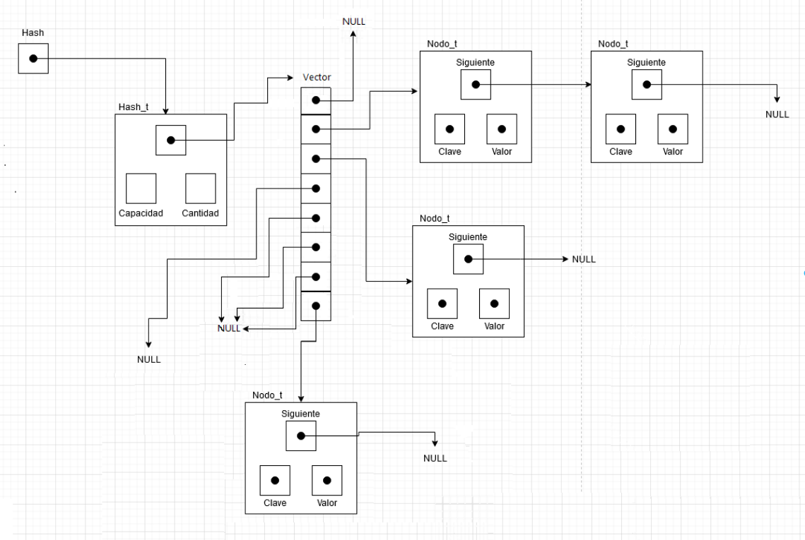
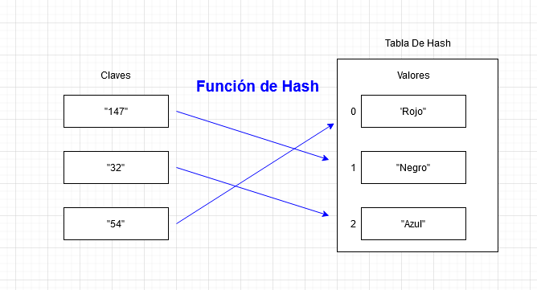
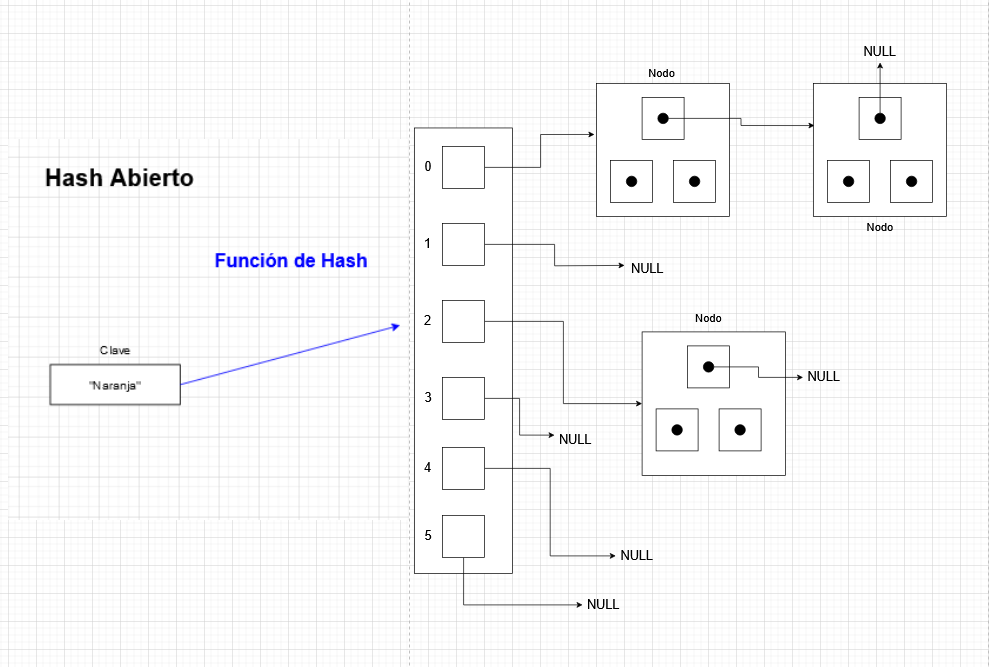
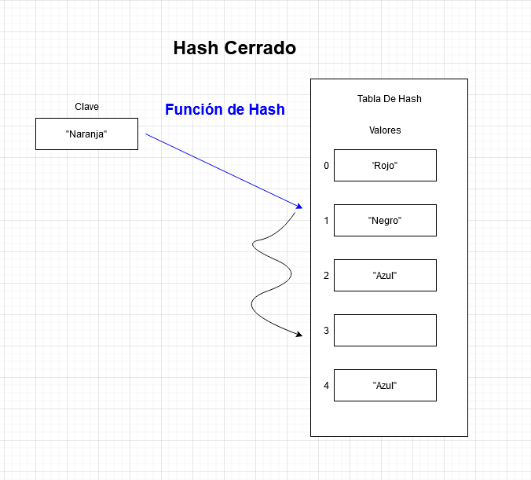

# TDA HASH

- Para compilar:

```bash
gcc -std=c99 -Wall -Wconversion -Wtype-limits -pedantic -Werror -O2 -g src/*.c pruebas_alumno.c -o pruebas_alumno
```

- Para ejecutar:

```bash
Para ejecutar con el ejemplo ./ejemplo

Para ejecutar con las pruebas implementadas ./pruebas_alumno
```

- Para ejecutar con valgrind:
```bash
valgrind --leak-check=full --track-origins=yes --show-reachable=yes --error-exitcode=2 --show-leak-kinds=all --trace-children=yes ./pruebas_alumno
```
---
##  Funcionamiento

En este TP, se implementó un **TDA Hash**, el Hash es un tipo de dato abstracto que consta de una tabla de Hash y una función de Hash elegida que en este caso será la función de Hash "DJB2". En esta ocasión se implementó un Hash Abierto es decir de direccionamiento cerrado en el cual en cada posición de la tabla de hash, se encontrará un nodo o una cadena de estos(o nada) que nos ayudaran a almacenar los valores de las claves obtenidas de manera tal que no se forme una colisión y que los valores que colisionen con la función de Hash puedan convivir en una misma posición de la tabla insertándolos en los diferentes nodos enlazados que contiene cada posición de la tabla. El Hash es muy útil a la hora de manejar datos ya que cada valor esta atado a su clave por lo que la busqueda y la manipulacion de datos será muy eficaz comparado a otros TDAs

Este TDA Hash está compuesto por dos estructuras, una y la mas importante, el **Hash**, que contendrá un puntero a un vector de nodos, donde se almacenaran los pares de clave-valor, su capacidad y la cantidad de claves que podrá almacenar. Con estas dos ultimas, se facilitará calcular el factor de carga de la tabla de una manera muy sencilla y así saber cuando agrandar el tamaño del Hash.
También tenemos una estructura **Nodo**, que como se dijo previamente, contiene un puntero a la clave, otro puntero al valor que almacena y un puntero al nodo que le sigue que nos ayudará a enlazar los nodos que les sigan.

<div align="center">

</div>

Para **crear** el Hash, se llama a la función `hash_crear()`, que con el uso de calloc, reserva memoria e inicializa los campos de nuestra estructura creada. A esta función se le deberá pasar una capacidad inicial que tendrá el Hash deseado, esta deberá ser mayor a 3 y si se pide una capacidad menor a 3, automáticamente se le dará una capacidad de 3 al Hash creado. Luego de reservar memoria para el Hash, se le reserva también memoria al vector según la cantidad inicial dada.

Para **insertar** lo primero que se hará será calcular el factor de carga de la tabla, el cual se calcula dividiendo la cantidad de claves en el hash y las divide por la capacidad total del Hash. Si este calculo da menos que 0.75, se hará un "rehash" que básicamente consta en aumentar la capacidad del Hash en el doble a la que ya era para así asegurar que todas las claves tengan un lugar asegurado. Es muy importante castear a float la capacidad y la cantidad ya que si no el resultado de la división serán números enteros y así nunca se podrá dar el rehash. `Rehash()` lo que hace es crear un nuevo Hash con el doble del espacio del anterior y con ayuda de nodo_actual iterar por el anterior hash y así insertar todos los elementos que tenia el viejo hash.
Al terminar de iterar, se libera el hash antiguo con ayuda de un auxiliar y devuelve el Nuevo hash que será igual al anterior pero con el doble del espacio. 
Con esto el Hash tendrá lugar para poder insertar el nuevo nodo deseado y se llamara a la función de Hash para determinar la posición a la que ira el nuevo nodo. Cuando tenemos la posición se llama a `nodo_insertar()` que verifica si la posición a insertar apunta a NULL, si este es el caso crea un nuevo nodo reservando le memoria e iniciándolo con los datos dados con ayuda de `nodo_crear()` y lo mete en la posición determinada. 
Si hay elementos dentro de la posición, se recorrerá el vector y verificara que la clave no se repita comparando con el resto de claves. Si se encuentra una clave repetida, se actualiza el valor de ese nodo al nuevo valor que se quiere insertar. Y si no, se encadenara el nodo al principio.

Esta función, para no perder lo que había en el lugar donde se insertó el nuevo valor, almacena lo que había previamente en la variable "anterior" para si saber que había y no perder el elemento. Si no había nada, "anterior" será NULL.

En el caso de querer **eliminar** elementos del Hash, se utiliza `hash_quitar()`, donde si en la posición obtenida con la función de Hash se encuentra algo, `nodo_quitar()` compara las claves que se encuentran en la posición hasta encontrar la deseada y cuando la encuentra se libera el elemento pedido, y el nodo que le seguía con ayuda de un auxiliar pasara al lugar del elemento eliminado.

Para **buscar** elementos en la tabla de Hash, se utilizara `hash_obtener()`, que funciona casi muy parecido a `hash_insertar()` ya que dándole una clave, si la posición dada por la función de Hash no es nula, comparara con el resto de claves hasta encontrarla y devolverá el valor de la clave buscada.

Si queremos saber si un elemento ya se encuentra dentro de la tabla, se utiliza `hash_contiene()` que de la misma manera que `hash_obtener()`, si la posición no es nula, devuelve true si el elemento esta o false si no esta.s

El TDA también cuenta con un **iterador interno** por el cual podemos manipular todas las claves dentro Hash según queramos mediante `hash_con_cada_clave()`, que básicamente itera por todas las posiciones del hash hasta haber iterado por todo el Hash o que la función pasada devuelva true, aplicando así la función dada por el usuario y devolverá la cantidad de veces que fue aplicada la función dada por el usuario.


---

## Respuestas a las preguntas teóricas

1)Un **Diccionario** es una estructura de datos que almacena asociación​es de dos tipos de elementos en pares, una clave y su valor.La principal función del Diccionario es mapear claves a valores. Cada clave del Diccionario es única y a través de ella podemos acceder a su valor, al ser únicas las claves, no hay duplicación de entradas. Con esto el Diccionario nos ayuda a tener una búsqueda mas eficaz y rápida de datos. Las claves funcionan como indices en el Diccionario y para acceder o ingresar un elemento se hace a través de la clave.

Un ejemplo podría ser tranquilamente un Diccionario lingüístico, donde para cada palabra, hay una definición. En este caso tomaríamos a las palabras como claves y a las definiciones como valores.

Puede ser implementado de varias formas pero en este caso lo implementaremos como una tabla de Hash.

2)La **funcion de Hash** es una función que a través de una función matemática, transforma claves a un numero asociado.
Esta debe tener una complejidad computacional eficiente en cualquier entrada, también debe tener una garantía de que cada clave de entrada distinta genere la mayor cantidad de claves hasheadas distintas y debe ser una función en la que sea casi imposible volver al las claves originales a partir de las claves ya hasheadas.

Estas funciones son muy utilizadas para almacenar contraseñas en bases de datos de maneras tales que al estar hasheadas sean muchísimo menos vulnerables y accesibles.


<div align="center">

</div>


3)**Las Tablas de Hash**, son estructuras de datos que almacenan valores a los cuales se acceden a través de las claves. Para saber en que posición de la Tabla se encuentra o se insertara el valor deseado, se utiliza una función de hash la cual transforma una clave otorgada por el usuario a una posición de la tabla según la función de Hash utilizada en la implementación. Algo negativo sobre la función de Hash, es que en algún momento se puede generar una colisión, es decir que dos claves diferentes al aplicarles la función de Hash nos den la misma posición. Estas colisiones se pueden resolver según el tipo de Hash que el programa utilice, este puede ser cerrado o abierto. 

**El Hash abierto**, este nombre se le da ya que los valores no se insertan dentro de la tabla de hash si no que están dentro de otro tipo de dato como lo puede ser en un Árbol o una lista enlazada o como en este TP en nodos enlazados. Esto es porque en cada posición de la tabla hay alguno otro tipo de dato que almacenara los valores dentro de el así los valores de estas claves colisionadas pueden compartir la misma posición en la tabla de Hash sin que se genere una colisión. A esto se le llama chaining o encadenamiento. El tipo de direccionamiento del hash abierto, es cerrado ya que la primer posición que se le dará a un valor en la tabla se mantendrá para siempre y no se volverá a cambiar de posición. Para la búsqueda de datos en este tipo de tabla, se necesitara un iterador interno para que itere dentro de la estructura que posee la tabla y se pueda ver cuantos o que valores hay en cada posición de la tabla.


<div align="center">

</div>
(Los bloques que apuntan a los nodos serian un "zoom" a las posiciones de la tabla de Hash)

En cambio en los **Hashes cerrados**, todos los valores se guardaran directamente dentro de la tabla de Hash y la capacidad de esta deberá ser siempre mayor o igual a la cantidad de claves. En este tipo de Hash, habrá colisiones en algún momento y estas se pueden solucionar de diferentes métodos.

-**Probing Lineal**: Este método consiste en ir a una posición mas en la tabla e intentar insertar el valor que produce la colisión en ese lugar y si la posición esta ocupada seguirá iterando hasta encontrar una posición vaciá y lograr insertar el valor en esa posición.

-**Probing Cuadrático**: Otro tipo de Probing es el cuadrático y este consiste en hacer una función que mediante los (intentos fallidos)al cuadrado, encuentre una posición vaciá.

-**Hash Doble**: Aplica otra función de Hash a la clave en caso de que haya ocurrido una colisión. 

**Zona de desborde**: La zona de desborde se llama así ya que es una zona dentro de la tabla de Hash que se reserva para asegurarle un lugar a los valores que generan colisiones. Si una colisión ocurre, se mandara el valor que colisiona a la zona de desborde inmediatamente en vez de iterar por toda la tabla como hace el Probing lineal.


<div align="center">

</div>

