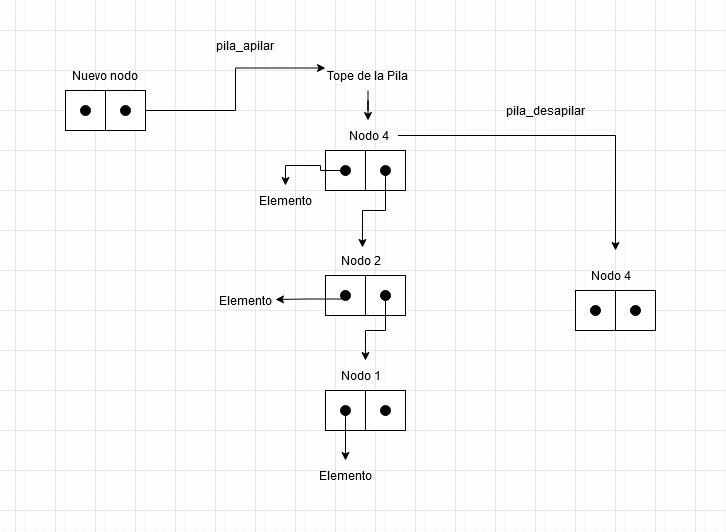
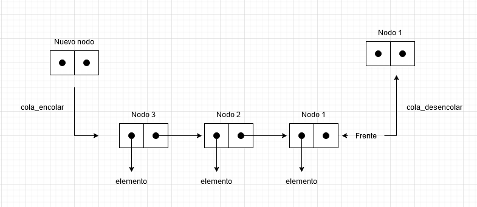

# TDA LISTA


- Para compilar:

```bash
gcc -std=c99 -Wall -Wconversion -Wtype-limits -pedantic -Werror -O2 -g src/*.c pruebas_alumno.c -o pruebas_alumno
```

- Para ejecutar:

```bash
Para ejecutar con un ejemplo ./ejemplo

Para ejecutar con las pruebas implementadas ./pruebas_alumno
```

- Para ejecutar con valgrind:
```bash
valgrind --leak-check=full --track-origins=yes --show-reachable=yes --error-exitcode=2 --show-leak-kinds=all --trace-children=yes ./pruebas_alumno
```
---
##  Funcionamiento

En esta entrega, tuvimos que implementar Tipos de datos abstractos mas conocidos como TDAs, en este caso una Lista simplemente enlazada con la que con sus funcionalidades tambien podemos crear una Pila o una Cola.

El TDA Lista esta formado por dos estructuras principales, La Lista, que contiene dos punteros, uno que apunta al primer nodo de la lista(nodo_inicio) y uno que apunta al ultimo nodo de la lista(nodo_fin) y tambien guarda la cantidad de nodos que hay dentro de la lista. La otra estructura es Nodo, esta contiene un puntero a un elemento que nosotros querramos guardar y un puntero al nodo que le sigue.

Con esto, podemos creamos una lista "enlazada" con los nodos y sus conexiones entre ellos donde el ultimo nodo de la lista sera el que apunte a NULL y ahi se dara por finalizada la lista.

Una gran ventaja de este TP es que al usar nodos enlazados en lugar de vectores dinamicos o estaticos es que la memoria utilizada no tiene que ser contigua por lo que no tendremos que hacer uso de realloc() cada vez que querramos agregar un nuevo elemento a la lista.

El TP tambien cuenta con dos iteradores uno externo y uno interno. Uno es un un nuevo TDA que funciona como un iterador externo, este ayuda recorrer la lista y poder manipularla mas rapido. Este cuenta con un puntero a los nodos que se encuentran dentro de la lista. Este puntero se inicializa en el primer elemento de la lista y a partir de ahi lo podemos hacer avanzar al nodo que le sigue o devolver el elemento que contiene.

El iterador interno no es un TDA nuevo si no que esta dentro de las funcionalidades de la lista, este debe ser invocado pasandole una funcion, la cual sera aplicada en todos los elementos de la lista y devolvera lo que el usuario le haya pedido.

El TDA lista contiene funciones que nos sirven para poder manipular los datos dentro de la lista sin ningun tipo de restriccion.

Para poder crear la lista, utilizamos lista_crear la cual con el uso de calloc nos reserva memoria para la misma e inicializa sus campos.

Para insertar objetos a la lista podemos usar lista_insertar la cual agrega un elemento deseado colocandolo al final de la lista que verificando que si la lista este vacia setea como nodo inicial y final al nodo agregado y si ya hay elementos hacemos que el ultimo nodo en la lista apunte al nodo agregado. Para agregar elementos en una posicion especifica de la lista, podemos utilizar lista_insertar_en_posicion la cual verifica si se quiere insertar el elemento al principio de la lista o en algun lugar del medio.
Si el lugar deseado es el principio de la lista, se actualiza el primer nodo de la lista, si la posicion es mayor al tamanio de la lista o la lista esta vacia, se inserta al final de la lista. Si la posicion deseada esta en el medio de la lista, hace que el nodo a insertar apunte al nodo que se encuentra en esa posicion y se actualiza el siguiente del nodo de la posicion anterior al nuevo nodo agregado asi logrando insertar el nuevo nodo entre medio de los que ya estaban.

En el caso de querer quitar elementos, podemos utilizar lista_quitar o lista_quitar_de_posicion que funcionan de una manera similar a las de insertar solo que esta si la lista esta vacia retorna NULL ya que no hay nada para sacar, si se quiere quitar el primer elemento de la lista se actualiza el primer nodo de la lista al que le sigue. Y si el elemento esta en el medio se utiliza un nodo auxiliar que le permite poder liberar la memoria del nodo eliminado sin perder el puntero al nodo. El auxiliar guarda el nodo que se quiere quitar y se actualiza el nodo anterior al eliminado para que su siguiente apunte al nodo que le seguia al nodo que se quiere quitar. Cuando se actualiza correctamente, el nodo auxiliar se libera asi quitando por completo el elemento deseado de la lista. 

El TDA tambien cuenta con mas funciones utiles para poder manejarse a traves de la lista y ver sus elementos como:

lista_elemento_en_posicion() que nos da el elemento en la posicion pedida, lista_buscar_elemento() que devuelve el primer elemento en la lista que cumpla con los requisitos que le pasemos a la funcion, lista_primero() que devuelve el primer elemento de la lista, lista_ultimo() devuelve el ultimo elemento de la lista, lista_tamanio() que devuleve la cantidad de elementos dentro de la lista y lista_destruir() o lista_destruir_todo() que libera toda la memoria utilizada tanto por los nodos como sus elementos.

---

## Respuestas a las preguntas teóricas
1)¿Qué es una lista/pila/cola?

Lista:
Una lista, es un tipo de dato abstracto que consiste en una coleccion de elementos ordenados en la cual podemos acceder, insertar o quitar elementos en cualquier posicion de esta misma sin restricciones. En este caso nosotros implementaremos una lista basada en nodo enlazados.
Esta se basa en que un nodo conociendo el nodo que le sigue pueda armar una lista "enlazada" donde el ultimo nodo de la lista sera el que apunte a NULL o a nada y ahi se dara por finalizada la lista.
Al ser una lista simplemente enlazada, los nodos solo conocen al nodo siguiente por lo que el recorrido es unidireccional.

Estructura de la lista simplemente enlazada implementada:
<div align="center">

</div>

La lista guarda en su estructura su nodo inicial, su nodo final y la cantidad de nodos que esta tiene actualmente.
La estructura del nodo guarda su elemento y el nodo siguiente o NULL en el caso que sea el ultimo nodo.


Pila:
El tipo de dato Pila es un TDA que nos deja guardar elementos de forma ordenada donde podemos acceder a ellos, agregar otros o eliminar los elementos que ya estan adentro. A diferencia de la Lista, la Pila si nos da restricciones al momento del manejo de sus elementos ya que esta tiene un sistema conocido como last in, first out(LIFO) por lo que solo podemos acceder al ultimo elemento agregado en la pila y manipular la pila desde su tope.

Estructura de la Pila:

<div align="center">

</div>

Asi funcionaria una pila con nodos enlazados, cuando queremos eliminar un elemento de la pila siempre sera el ultimo elemento agregado, es decir esta en el tope de la pila, lo mismo sucede si queremos agregar un nuevo elemento, este se apilara encima del ultimo elemento que fue agregado en la pila y pasara a ser el nuevo tope.


Cola:
La cola es un tipo de dato que permite guardar datos de manera ordenada y poder manipular, agregar o eliminar elementos en la cola. Esta tambien nos da restricciones a la hora de trabajar con sus elementos y a diferencia de la Pila, la Cola funciona con un sistema llamado first in, first out(FIFO), lo que nos indica que solo podemos tener acceso al primer elemento que fue insertado en la cola, es decir el mas antiguo.

Estructura de la Cola:

<div align="center">

</div>

El diagrama muestra una Cola implementada con nodos enlazados, si queremos eliminar un elemento de la cola, se quitara el que esta en el frente, osea el que fue insertado por primera vez en la Cola, en el caso de agregar un nuevo elemento a la Cola, este se insertara al final de la misma y quedara ahi hasta que quiten los elementos que estan adelante por el frente.

2)Explica y analiza las diferencias de complejidad entre las implementaciones de lista simplemente enlazada, doblemente enlazada y vector dinámico para las operaciones:

    Insertar/obtener/eliminar al inicio
    Insertar/obtener/eliminar al final
    Insertar/obtener/eliminar al medio


Las grandes diferencias entre las implementaciones de un vector dinamico con una lista simple o doblemente enlazada es que el vector dinamico nos pide tener memoria contigua utilizando realloc() para agrandar o achicar la lista cada vez que agregamos o quitamos un elemento. Esto en listas chicas no se consideraria como un gran problema pero en listas con muchos elementos corremos el peligro de que realloc no encuentre un nuevo bloque de memoria para darnos.

En cambio la lista con nodos enlazadados nos da la ventaja de poder ir agrandando la lista cuando sea necesario sin depender de memoria contigua ya que los nodos recuerdan las direcciones de sus nodos siguientes o/y anteriores en el caso de la lista doblemente enlazada, por lo que solo se necesita pedir memoria para un nodo nuevo. Ademas las listas enlazadas nos permiten manejar listas largas y de tamanio variable sin correr peligro de tener que buscar nuevos bloques de memoria para guardar la lista. 

La diferencia entre una lista simplemente enlazada con una doblemente enlazada es que en la simple los nodos solo conocen al nodo siguiente por lo que el recorrido es unidireccional, mientras que en la doblemente enlazada tiene un recorrido bidireccional ya que sus nodos tambien conocen a su nodo anterior. 


Las complejidades al manipular la lista serian:

En Vector dinamico:

Al inicio:
insertar y eliminar o(n) ya que debe llamar a realloc para poder agrandar o achicar el vector y buscar o(1) ya que simplemente le pedimos el vector y su posicion.

En el medio:
Insertar y eliminar o(n) ya que para insertar o quitar elementos debemos llamar a realloc para que nos reserve o achique una seccion en la memoria. Y para buscar o(1) ya que simplemente le pedimos el vector y su posicion.

Al final:
insertar y eliminar o(n) ya que debe llamar a realloc para poder agrandar o achicar el vector y buscar o(1) ya que simplemente le pedimos el vector y su posicion.


En Lista simplemente enlazada:

Al inicio:
insertar, buscar y eliminar o(1) ya que no dependemos de la cantidad de elementos en la lista.

En el medio:
Insertar, buscar y elminar o(n) ya que debemos recorrer la lista.

Al final:
insertar y buscar o(1) y eliminar o(n) ya que debemos buscar la posicion del nodo que apunte al ultimo nodo.


En Lista doblemente enlazada:

Al inicio:
insertar buscar y eliminar o(1) ya que no dependemos de la cantidad de elementos en la lista.

En el medio:
Insertar buscar y elminar o(n/2) ya que debemos recorrer la lista en ambas direcciones.

Al final:
insertar buscar y eliminar o(1).


3)Explica la complejidad de las operaciones implementadas en tu trabajo para la pila y la cola.

pila_crear() / cola_crear(): Se les reserva memoria a los TDAs e inicializa sus campos. La complejidad de estas funciones es de O(1) porque solo crea los elementos y ya esta.

pila_apilar() / cola_encolar(): Agrega un elemento a los TDAs. Su complejidad es de O(1) porque no depende del largo del TDA.

pila_desapilar() / cola_desencolar(): Quita un elemento de los TDAs. Su complejidad es de O(1) porque no depende del largo del TDA.

pila_tope() / cola_frente(): Devuelve el elemento que esta en el tope de la Pila o en el frente de la Cola dependendiendo el caso. Su complejidad es de O(1) porque simplemente devuelve una posicion que ya conocemos.

pila_tamanio() / cola_tamanio(): Devuelve la cantiad de elementos que hay en el TDA. Su complejidad es O(1) ya que solo devuelve el tamanio.

pila_vacia() / cola_vacia(): Devuelve true si el TDA no tiene elementos o false si tiene. Su complejidad es de O(1) porque simplemente verifica si el TDA esta vacio.

pila_destruir() / cola_destruir(): Destruye todos lo que hay en dentro del TDA. Su complejidad es de O(n) porque debe destruir nodo por nodo y cada elemento en ellos.