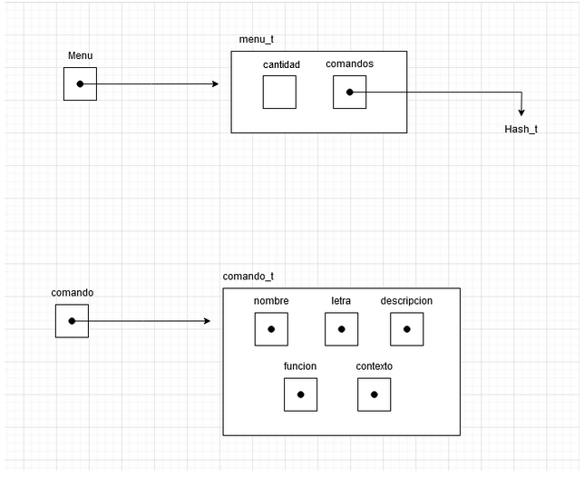

# TP2


- Para compilar:

```bash
make ejemplo
```

- Para ejecutar:

```bash
./tp2

Para ver las pruebas del TDA menu: make pruebas_menu
```

- Para ejecutar con valgrind:
```bash
valgrind ./tp2

Para ver las pruebas del TDA menu: make valgrind-alumno
```
---
##  Funcionamiento

Para este TP, se pidió mejorar el TP1 a un programa que simule un Hospital de Pokemones con todo la aprendido en la cursada.

Para esto se nos pidió implementar algún TDA nuevo que nos ayude a que la implementación del programa sea mas fácil.

Por lo que decidí implementar un TDA Menú. El Menú, tiene la finalidad de ser justamente un menú el cual se puede almacenar comandos con el uso de un hash donde los almacenara y podrán ser agregados, eliminados o manipulados según el usuario desee.

Elegí utilizar un hash para almacenar los comandos ya que el hash nos permite acceder de una manera muy rápida y con complejidad de O(1) a los comandos que guardemos simplemente pasándole el nombre del comando. Ademas los comandos no necesitan estar ordenados por lo tanto sentí que el uso del Hash es lo mas favorable comparando con otros TDAs vistos.

Para el poder agregar comandos, se creo la estructura comando la cual guarda un puntero a su nombre, un puntero a una letra que lo identifique, una función que haga el comando agregado y un contexto.

<div align="center">

</div>


Para crear el menú, se invoca a `menu_crear()` la cual reservara la memoria necesaria para nuestro menú y crea el hash de los comandos.

Si queremos agregar un nuevo comando al menú, se utiliza `menu_agregar_comando()`, que pasándole el menú y las características del comando(nombre, letra, descripción del comando, su función y su contexto). Reservara memoria para el comando y lo insertara en el hash de comandos del menú.

En el caso de querer eliminar un comando del menú, se llama a `menu_eliminar_comando()` que pasándole el menú y el nombre del comando almacenado previamente, se quitara el comando del hash de comandos y se liberara el comando.

Para poder ejecutar un comando, es necesario que ya este dentro del menú, para ejecutar, se usa `menu_ejecutar_comando()`, que busca el comando pasado dentro del hash del menú y ejecuta la función que se le haya asignado al comando al ser ingresado.

Por ultimo se podrá saber si el menú contiene un comando con `menu_contiene()` o ver si se encuentra vació con `menu_vacio()`.

Y para destruirlo, se utilizara `menu_destruir()`.


## Programa:

Se pidió mejorar el TP para esto, decidí crear 2 estructuras nuevas, una que simula ser un hash nuevo que almacena hospitales en un hash y un nombre del hospital activo actual. La otra estructura es "hospital_ad" donde ad se refiere a adicional, ya que servirá como una estructura "adicional" que facilitara las cosas para poder trabajar mas fácil con el TP, esta estructura, almacena un puntero a hospital, su nombre y un booleano que indica si es el hospital activo o no.

Este programa, sirve para manejar y almacenar diferentes hospitales, estos se podrán manipular con la ayuda de diversos comandos que son insertados con la ayuda del TDA Menú, con los cuales podremos ver los pokemones que están siendo atendidos en ellos y agregar o eliminar los Hospitales dentro de nuestro programa. 

Los comandos que posee nuestro programa son los siguientes:
  - S (salir/exit): Sale del programa.
  - H (ayuda/help): Muestra un menú de ayuda con los comandos disponibles.
  - C (cargar): Pide un nombre de archivo e intenta cargarlo creando un hospital. El hospital queda identificado con 
      un número y el nombre del archivo.
  - E (estado): Muestra un listado con los hospitales cargados (y el activo, si alguno).
  - A (activar): Pide un número de identificación y activa el hospital. El resto de las operaciones se realizan sobre el hospital activo.
  - M (mostrar): Muestra un listado con los nombres de todos los pokemones en el hospital.
  - L (listar): Muestra un listado de todos los pokemones en el hospital con sus características.
  - D (destruir): Destruye el hospital activo.

El programa tratara de detectar sinónimos de los nombres de los comandos al ser llamados para que el usuario no tenga que trabarse mucho al usar el programa y aceptara tanto mayúsculas como minúsculas.

Si no se detecta ningún comando o alguno de sus sinónimos el programa indicara que insertando 'h' se podrá desplegar una lista con los comandos y sus respectivos identificadores.